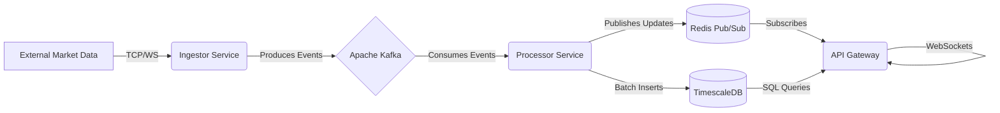

# 🚀 Real-Time Fintech Trading Engine


A high-performance, fault-tolerant, and distributed trading engine built entirely in **Rust**. This system creates a real-time pipeline to ingest, process, store, and broadcast cryptocurrency market data with millisecond latency.

Designed to demonstrate **Microservices Architecture**, **Event-Driven Patterns**, and **High-Throughput Data Processing**.

---

## 🏗 Architecture

The system is composed of three decoupled microservices communicating via **Apache Kafka** and **Redis**:



### 🧩 Components

**1. Ingestor Service:**

- Connects to external exchanges (simulated or real).
- Normalizes data into `Protobuf` format.
- Produces high-throughput streams to Kafka topics.
- **Tech:** Rust, rdkafka.

**2. Processor Service (The Brain):**

- Consumes trade streams from Kafka.
- Calculates technical indicators (SMA - Simple Moving Average) using a **Sliding Window** algorithm.
- Generates BUY/SELL signals in real-time.
- **Optimization:** Implements **Batch Insertions** to TimescaleDB to handle high write loads efficiently.
- **Fault Tolerance:** Features robust retry logic and connection management for Database and Broker availability.
- **Tech:** Rust, Tokio, SQLx, Redis-rs.

**3. API Gateway:**

- Exposes a REST API for historical data lookup.
- Manages **WebSockets** for broadcasting real-time price and signal updates to clients.
- **Tech:** Rust, Axum, Tower.

---

## 🛠 Tech Stack

- **Language:** Rust
- **Message Broker:** Apache Kafka (Running in **KRaft** mode - Zookeeperless).
- **Database:** TimescaleDB (PostgreSQL extension optimized for time-series).
- **Caching & Pub/Sub:** Redis.
- **Observability:** Jaeger (OpenTelemetry tracing integration).
- **Containerization:** Docker & Docker Compose (Multi-stage builds for small binary footprints).

---

## 🚀 Getting Started

### Prerequisites

- Docker & Docker Compose installed on your machine.

### Installation & Running

The entire stack is containerized. You can spin up the environment with a single command.

1.  **Clone the repository:**

    ```bash
    git clone [https://github.com/your-username/realtime-fintech-engine.git](https://github.com/your-username/realtime-fintech-engine.git)
    cd realtime-fintech-engine
    ```

2.  **Initialize Database:**
    First, start the database container to apply schemas.

    ```bash
    docker compose up -d timescaledb
    ```

3.  **Apply Migrations:**
    Ensure the database schema is created before starting the application logic.

    ```bash
    # Migrate Db
    sqlx migrate run
    ```

4.  **Start the full stack:**
    Once the database is ready, spin up the rest of the services.

    ```bash
    docker compose up -d --build
    ```

---

## 🔌 API Documentation

### HTTP Endpoints

| Method | Endpoint                  | Description                                                                               |
| :----- | :------------------------ | :---------------------------------------------------------------------------------------- |
| `GET`  | `/api/v1/history/:symbol` | Returns the last 100 stored trades for a given symbol (e.g., BTCUSDT) from TimescaleDB.   |
| `GET`  | `/api/v1/btc`             | Returns the latest snapshot of price, SMA, and current trading recommendation (BUY/SELL). |

### WebSockets

| Endpoint | Protocol | Description                                                         |
| :------- | :------- | :------------------------------------------------------------------ |
| `/ws`    | `ws://`  | Stream real-time JSON updates including Price, SMA-20, and Signals. |
